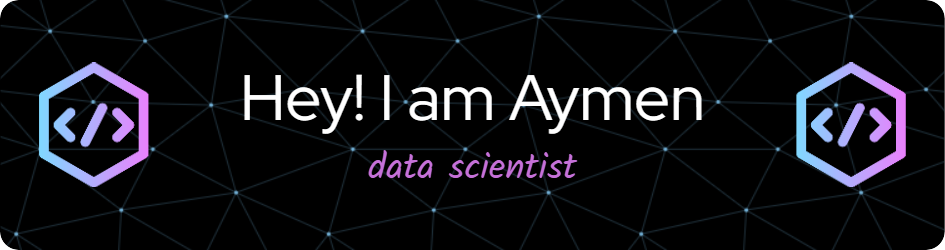

  

- 🌱 I’m currently **data scientest**

- 👯 I’m looking to collaborate on **Data Related Projects**

- 👨‍💻 All of my projects are available at [https://github.com/aymen-fkir](https://github.com/aymen-fkir)

- 💬 Ask me about **Data science & data engineering**

- 📫 How to reach me **aymenfkir23@gmail.com**
- 🖥️ Check my website [aymen.fkir](https://portfolio-coral-ten-79.vercel.app/)

<h3 align="left">Connect with me:</h3>

  

<h3 align="left">Languages and Tools:</h3>

                  

